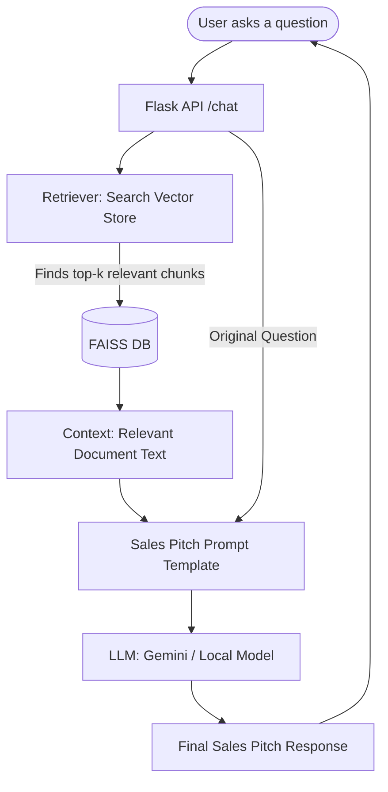

# Cadient Chat Bot Flow

To view the diagram, make sure you have the **Mermaid Preview** extension installed in your IDE, or view this file in a Markdown-compatible viewer.

---

### Step-by-Step Breakdown

#### 1. Ingestion Phase (The "Brain" Building)
Before the bot can answer, it needs to "learn" your documents.
*   **Loading:** It reads documents from your `docs/` folder.
*   **Splitting:** Large files are broken into smaller chunks (`rag/splitter.py`).
*   **Embedding:** Each chunk is converted into a numerical vector using HuggingFace embeddings.
*   **Storage:** These vectors are saved in a **FAISS** index (`vectorstore/`).

#### 2. Retrieval Phase (The "Search" Step)
When you ask a question:
*   The bot converts your **question** into a vector.
*   It searches the **FAISS index** for the chunks that are mathematically most similar to your question.

#### 3. Generation Phase (The "Response" Step)
*   **Augmentation:** The bot combines your question with the snippets found during retrieval.
*   **Prompting:** It uses a specialized "Sales Pitch" prompt (`rag/prompt.py`) to instruct the LLM.
*   **LLM Execution:** The combined text is sent to the LLM (Gemini or Local).
*   **Result:** The LLM generates a natural language response based on your documents.
