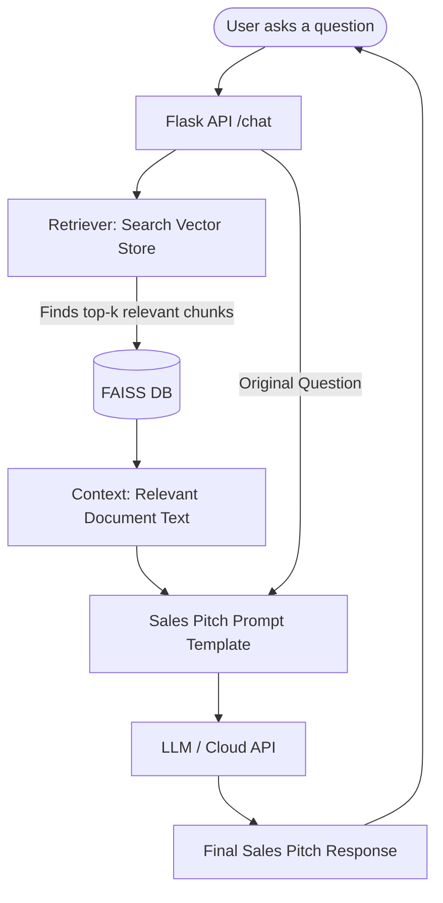

# 🤖 Cadient Chat Bot

Cadient Chat Bot is a high-performance **Retrieval-Augmented Generation (RAG)** application designed to provide context-aware sales pitches and information based on your local documentation. It leverages state-of-the-art LLMs and vector databases to deliver accurate, document-driven responses.

---

## 🚀 Overview

The bot functions by "learning" from your documents (PDFs, DOCX, TXT), storing them as numerical embeddings in a vector database, and then retrieving the most relevant sections to answer user queries.

### 🔄 Process Flow



---

## ✨ Features

- **Contextual Intelligence**: Answers questions based strictly on your provided documents.
- **Dual Vector Store Support**: Works with **FAISS** (Local) or **Pinecone** (Cloud).
- **Flexible LLM Integration**: Supports cloud-based models (Gemini/Mistral) or local models via HuggingFace.
- **Sales-Optimized Prompting**: Specially tuned to generate persuasive and professional sales-oriented responses.
- **Easy Ingestion**: Simple script to process and index new documents in seconds.

---

## 🛠️ Tech Stack

- **Backend**: Flask (Python)
- **RAG Framework**: LangChain
- **Embeddings**: HuggingFace (`sentence-transformers/all-MiniLM-L6-v2`)
- **Vector Search**: FAISS (Local) / Pinecone (Cloud)
- **Document Processing**: docx2txt, LangChain Splitters
- **Model**: Mistral-7B / Google Gemini

---

## 📂 Project Structure

```text
cadient-chat-bot/
├── docs/                # Source documents (Place your files here)
├── rag/                 # RAG logic (Splitters, Prompts, etc.)
├── services/            # Core business logic and service wrappers
├── templates/           # UI templates (HTML)
├── vectorstore/         # Local FAISS index storage
├── app.py               # Main Flask application
├── config.py            # Global configuration management
├── ingest.py            # script to process documents into the vector store
├── PROCESS_FLOW.md      # Detailed internal logic documentation
├── requirements.txt      # Python dependencies
└── .env                 # Environment variables (API keys)
```

---

## ⚙️ Setup & Installation

### 1. Clone the Repository
```bash
git clone <repository-url>
cd "cadient chat bot"
```

### 2. Create a Virtual Environment
```bash
python -m venv venv
source venv/bin/activate  # On Windows: venv\Scripts\activate
```

### 3. Install Dependencies
```bash
pip install -r requirements.txt
```

### 4. Configure Environment Variables
Create a `.env` file in the root directory and add your keys:
```env
HUGGINGFACEHUB_API_TOKEN=your_token_here
PINECONE_API_KEY=your_pinecone_key  # Optional
PINECONE_INDEX_NAME=your_index_name # Optional
```

---

## 📖 Usage

### Phase 1: Ingesting Documents
Place your documentation in the `docs/` folder, then run:
```bash
python ingest.py
```
This will chunk the documents and create the FAISS index in `vectorstore/`.

### Phase 2: Running the Chatbot
Start the Flask server:
```bash
python app.py
```
The application will be available at `http://localhost:5000`.

---

## 🔌 API Endpoints

### `POST /chat`
Send a JSON payload to interact with the bot.

**Request:**
```json
{
  "message": "What are the benefits of Cadient software?"
}
```

**Response:**
```json
{
  "response": "Cadient offers a robust solution for recruitment, specifically designed to..."
}
```

---

## 🛡️ License
This project is proprietary. All rights reserved.
